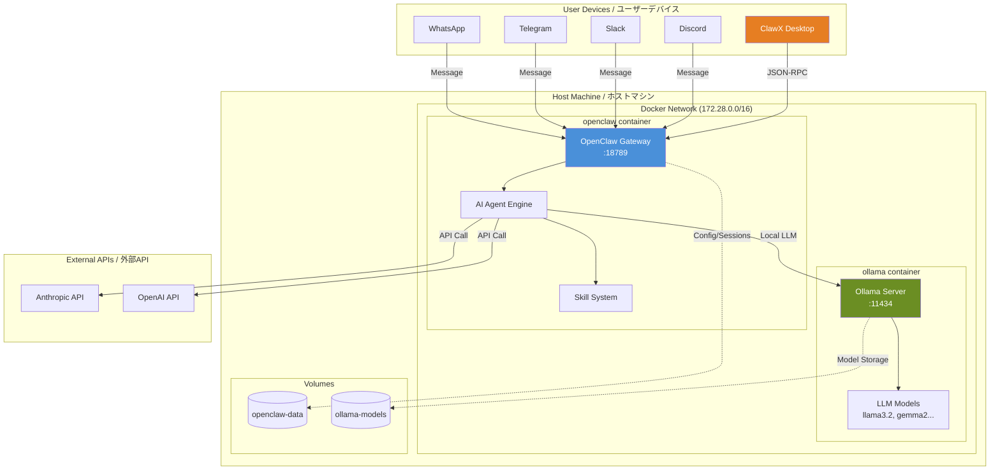
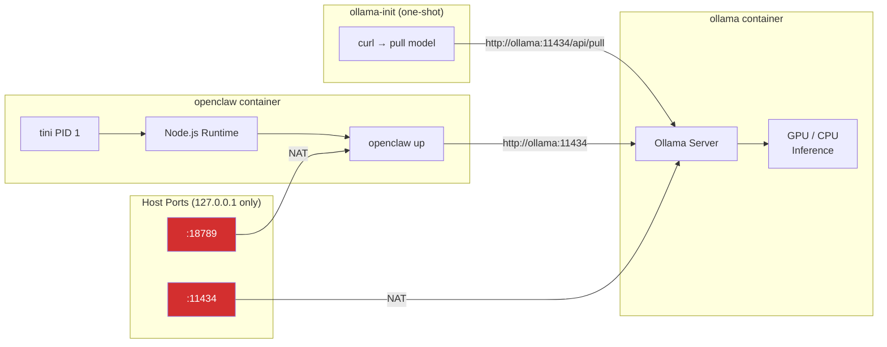
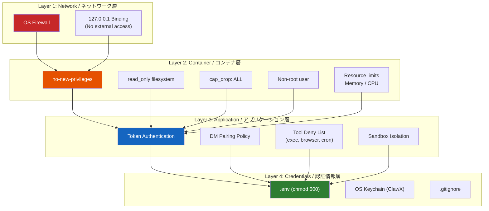
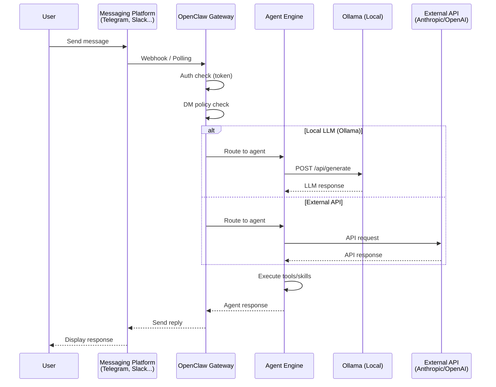
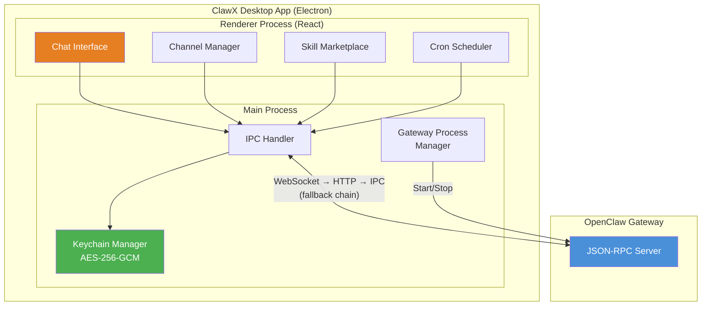
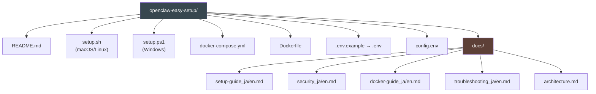

# Architecture / アーキテクチャ

[← Back to top / トップに戻る](../README.md)

---

## System Overview / システム概要

---

## Docker Container Architecture / コンテナ構成

---

## Security Layers / セキュリティレイヤー

---

## Data Flow / データフロー

---

## ClawX Architecture / ClawX アーキテクチャ

---

## File Structure / ファイル構成

---

## Cross-Platform Path Strategy / クロスプラットフォームのパス戦略

### Why all paths look like Linux / なぜすべてのパスが Linux 形式なのか

This project uses Linux-style paths (`/home/openclaw/.openclaw`) in Dockerfile, entrypoint.sh, and docker-compose.yml. This is intentional — **Docker containers always run Linux internally**, regardless of the host OS.

このプロジェクトでは Dockerfile、entrypoint.sh、docker-compose.yml で Linux 形式のパス（`/home/openclaw/.openclaw`）を使っています。これは意図的なものです — **Docker コンテナの内部は常に Linux** であり、ホスト OS に関係ありません。

```mermaid
graph TB
    subgraph "macOS Host"
        DD1[Docker Desktop for Mac]
        VM1["Linux VM (HyperKit / Virtualization.framework)"]
        DD1 --> VM1
        VM1 --> C1["Container<br/>/home/openclaw/.openclaw"]
    end

    subgraph "Windows Host"
        DD2[Docker Desktop for Windows]
        VM2["WSL2 / Hyper-V (Linux kernel)"]
        DD2 --> VM2
        VM2 --> C2["Container<br/>/home/openclaw/.openclaw"]
    end

    subgraph "Linux Host"
        DE[Docker Engine]
        DE --> C3["Container<br/>/home/openclaw/.openclaw"]
    end

    style C1 fill:#4A90D9,color:#fff
    style C2 fill:#4A90D9,color:#fff
    style C3 fill:#4A90D9,color:#fff
```

### Path mapping by OS and install mode / OS・インストール方式別のパス対応表

| Component | Path | Scope | Notes |
|-----------|------|-------|-------|
| `Dockerfile` | `/home/openclaw/.openclaw` | Container only | Always Linux — works on all host OSes |
| `entrypoint.sh` | `/home/openclaw/.openclaw` | Container only | Runs inside Linux container |
| `docker-compose.yml` volumes | `openclaw-data` → `/home/openclaw/.openclaw` | Container only | Docker manages host-side storage |
| `setup.sh --native` | `$HOME/.openclaw` | Host machine | Expands correctly on macOS and Linux |
| `setup.ps1` (Windows) | WSL2 internal: `$HOME/.openclaw` | WSL2 (Linux) | OpenClaw runs inside WSL2 |
| ClawX (Desktop) | OS-native paths | Host machine | Electron manages its own config location |

| コンポーネント | パス | スコープ | 備考 |
|-------------|------|---------|------|
| `Dockerfile` | `/home/openclaw/.openclaw` | コンテナ内部のみ | 常に Linux — 全ホスト OS で動作 |
| `entrypoint.sh` | `/home/openclaw/.openclaw` | コンテナ内部のみ | Linux コンテナ内で実行される |
| `docker-compose.yml` ボリューム | `openclaw-data` → `/home/openclaw/.openclaw` | コンテナ内部のみ | Docker がホスト側のストレージを管理 |
| `setup.sh --native` | `$HOME/.openclaw` | ホストマシン | macOS・Linux で正しく展開される |
| `setup.ps1`（Windows） | WSL2 内部: `$HOME/.openclaw` | WSL2（Linux） | OpenClaw は WSL2 内で動作 |
| ClawX（デスクトップ） | OS ネイティブパス | ホストマシン | Electron が独自の設定パスを管理 |

### How Docker volumes abstract host paths / Docker ボリュームによるパス抽象化

When you use **named volumes** (e.g., `openclaw-data`), Docker manages the actual storage location on the host automatically:

**名前付きボリューム**（例: `openclaw-data`）を使う場合、Docker がホスト上の実際の保存場所を自動管理します：

| Host OS | Actual volume storage location |
|---------|-------------------------------|
| Linux | `/var/lib/docker/volumes/openclaw-easy-setup_openclaw-data/_data` |
| macOS | Inside Docker Desktop's Linux VM (transparent to user) |
| Windows | Inside WSL2's Linux filesystem (transparent to user) |

Users never need to know these host paths — Docker handles everything. The `docker volume` commands work identically on all platforms.

ユーザーがホスト側のパスを知る必要はありません。Docker がすべて処理します。`docker volume` コマンドは全プラットフォームで同じように動作します。

---

## Port Map / ポートマップ

| Port | Service | Bound To | Protocol | Purpose |
|------|---------|----------|----------|---------|
| 18789 | OpenClaw Gateway | 127.0.0.1 | HTTP/WS | AI agent API, dashboard |
| 11434 | Ollama | 127.0.0.1 | HTTP | LLM inference API |

---

## Volume Map / ボリュームマップ

| Volume | Container Path | Purpose |
|--------|---------------|---------|
| `openclaw-data` | `/home/openclaw/.openclaw` | Config, sessions, channels |
| `ollama-models` | `/root/.ollama` | Downloaded LLM model weights |
| `./config/openclaw` (bind) | `/etc/openclaw` (read-only) | Host config overlay |

---

## Technology Stack / 技術スタック

| Layer | Technology |
|-------|-----------|
| Container | Docker, Docker Compose |
| Runtime | Node.js 22, tini |
| AI Gateway | OpenClaw |
| Local LLM | Ollama |
| Desktop GUI | ClawX (Electron + React) |
| Credential Storage | OS Keychain (macOS Keychain, Windows Credential Manager, libsecret) |
| Encryption | AES-256-GCM |
| Init System | tini (PID 1) |
